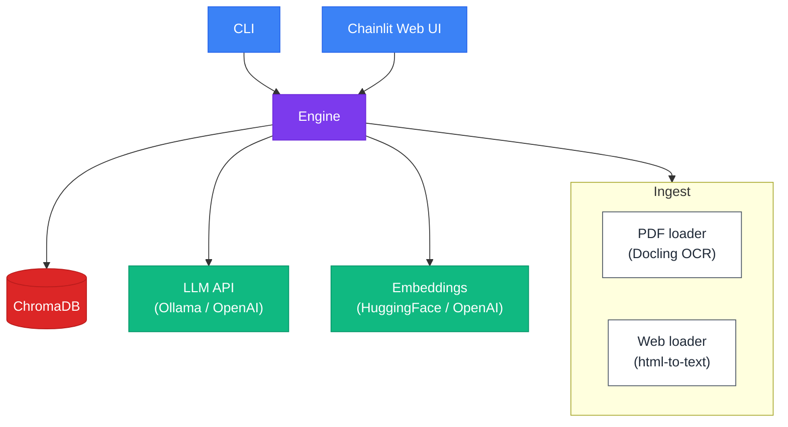

# Textbook AI Assistant

[](https://www.python.org/downloads/)
[](https://www.gnu.org/licenses/gpl-3.0)

An interactive AI tutor for textbooks using RAG (Retrieval-Augmented Generation). Ingests PDF or web sources into a ChromaDB vector store, then answers questions via a LlamaIndex chat engine (interactive CLI or Chainlit web UI).


## Features

- **Multi-source ingestion** — PDF files (with OCR and table extraction via Docling) and web URLs
- **Pluggable embeddings** — HuggingFace (local, free) or OpenAI
- **Configurable LLM** — Any OpenAI-compatible API (Ollama, OpenAI, vLLM, etc.)
- **Persistent vector store** — ChromaDB stores embeddings locally, so re-ingestion is skipped on subsequent runs
- **Dual interfaces** — Interactive CLI for quick questions, Chainlit web UI for a richer experience
- **Advanced retrieval** — MMR, default, or hybrid search modes with configurable top-k
- **Flexible configuration** — YAML defaults, user config overrides, environment variables, and CLI flags (in that priority order)

## Architecture



## Prerequisites

- Python 3.11 or higher
- [uv](https://docs.astral.sh/uv/) package manager
- [Ollama](https://ollama.com/) (for the default local LLM setup) — or any OpenAI-compatible API

## Installation

1. **Clone the repository**
   ```bash
   git clone https://github.com/PierreExeter/textbook-AI-assistant.git
   cd textbook-AI-assistant
   ```

2. **Install dependencies**
   ```bash
   uv sync
   ```

3. **Set up environment variables**
   ```bash
   cp .env.example .env
   ```

   Edit `.env` as needed (see [Configuration](#configuration) below).

## Ollama Setup

If using the default local LLM:

1. [Install Ollama](https://ollama.com/download)
2. Pull a model:
   ```bash
   ollama pull llama3.2
   ```
3. Ollama serves on `http://localhost:11434` by default — no API key required.

## Usage

### CLI

```bash
# Ask questions about a PDF textbook
uv run textbook-ai textbook/attention-is-all-you-need.pdf

# Ask questions about a web page
uv run textbook-ai https://example.com/article

# Override the LLM model
uv run textbook-ai textbook/attention-is-all-you-need.pdf --llm-model mistral

# Use OpenAI embeddings instead of HuggingFace
uv run textbook-ai textbook/attention-is-all-you-need.pdf --provider openai

# Use a custom config file
uv run textbook-ai textbook/attention-is-all-you-need.pdf --config my_config.yaml

# Verbose logging
uv run textbook-ai textbook/attention-is-all-you-need.pdf -v
```

The CLI auto-detects the source type (PDF vs. web) from the path. Type your questions interactively, and type `quit` or `exit` to stop.

### Web UI

```bash
TEXTBOOK_AI_SOURCE__PATH=textbook/attention-is-all-you-need.pdf uv run chainlit run src/textbook_ai/chainlit_app.py
```

The Chainlit app opens in your browser at `http://localhost:8000`.

## Configuration

Configuration is resolved in this order (highest priority first):

1. Environment variables (`TEXTBOOK_AI_SECTION__KEY`)
2. User config YAML (`--config`)
3. `config/default.yaml`

### Key Environment Variables

| Variable | Description | Default |
|---|---|---|
| `LLM_API_KEY` | API key for the LLM provider | `"ollama"` |
| `OPENAI_API_KEY` | API key when using OpenAI embeddings | — |
| `TEXTBOOK_AI_SOURCE__TYPE` | Source type (`pdf` or `web`) | `"pdf"` |
| `TEXTBOOK_AI_SOURCE__PATH` | Source file path or URL | — |
| `TEXTBOOK_AI_LLM__MODEL` | LLM model name | `"llama3.2"` |
| `TEXTBOOK_AI_LLM__API_BASE` | LLM API URL | `"http://localhost:11434/v1"` |
| `TEXTBOOK_AI_EMBEDDINGS__PROVIDER` | `huggingface` or `openai` | `"huggingface"` |
| `TEXTBOOK_AI_RETRIEVER__SEARCH_TYPE` | `default`, `mmr`, or `hybrid` | `"mmr"` |
| `TEXTBOOK_AI_RETRIEVER__TOP_K` | Number of chunks to retrieve | `5` |

Any config field can be overridden via `TEXTBOOK_AI_SECTION__KEY` (double underscore for nesting). See `config/default.yaml` for all options.

## Project Structure

```
config/default.yaml              # Default configuration (all options with defaults)
src/textbook_ai/
  cli.py                         # CLI entry point with argparse
  chainlit_app.py                # Chainlit web UI handlers
  engine.py                      # Central orchestrator — build_chat_engine()
  config.py                      # Dataclasses + 3-tier config loading
  index.py                       # ChromaDB index creation/loading + LlamaIndex Settings
  types.py                       # Shared dataclasses (SourceInfo, ChatResponse)
  ingest/
    __init__.py                  # Type-based dispatcher to pdf/web loaders
    pdf.py                       # PDF ingestion via DoclingReader
    web.py                       # Web ingestion via SimpleWebPageReader
tests/                           # Test suite
```

## Development

### Running Tests

```bash
uv run --frozen pytest
uv run --frozen pytest tests/test_config.py -v   # single file
```

Tests use `IS_TESTING=1` so no real model downloads or LLM calls are needed.

### Code Quality

```bash
# Formatting
uv run --frozen ruff format .

# Linting
uv run --frozen ruff check . --fix

# Type checking
uv run --frozen pyright
```

## Security Notes

- Never commit `.env` or API keys
- The `.gitignore` excludes `.env` and the `.textbook_ai_index/` data directory
- When using Ollama locally, no API keys leave your machine

## License

[GPL-3.0](LICENSE)

## Contributing

Contributions are welcome! Please open an issue or submit a pull request.
