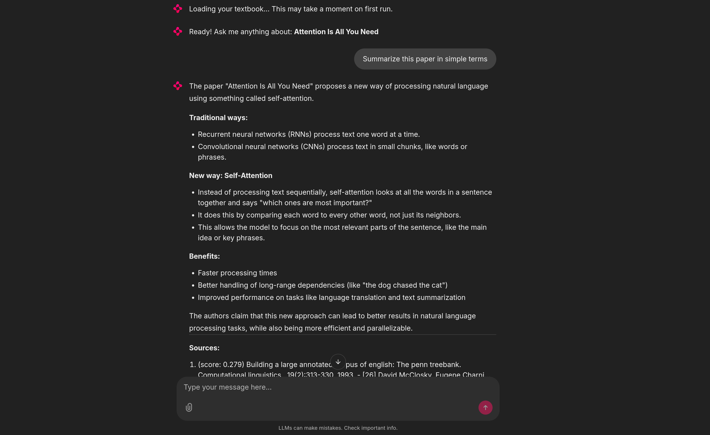

# Textbook AI Assistant

[](https://www.python.org/downloads/)
[](https://www.gnu.org/licenses/gpl-3.0)

An interactive AI tutor for textbooks using RAG (Retrieval-Augmented Generation). Ingests PDF or web sources into a ChromaDB vector store, then answers questions via a LlamaIndex chat engine (interactive CLI or Chainlit web UI).



## Features

- **Multi-source ingestion** -- PDF files (with OCR and table extraction via Docling) and web URLs
- **Pluggable embeddings** -- HuggingFace (local, free) or OpenAI
- **Configurable LLM** -- Any OpenAI-compatible API (Ollama, OpenAI, vLLM, etc.)
- **Persistent vector store** -- ChromaDB stores embeddings locally, so re-ingestion is skipped on subsequent runs
- **Dual interfaces** -- Interactive CLI for quick questions, Chainlit web UI for a richer experience
- **Advanced retrieval** -- MMR, default, or hybrid search modes with configurable top-k
- **Flexible configuration** -- YAML defaults, user config overrides, environment variables, and CLI flags

## Documentation

| | |
|---|---|
| **[Getting Started](docs/getting-started.md)** | Install, pull a model, and ask your first question |
| **[Usage](docs/usage.md)** | CLI flags, web UI, LLM and embedding provider switching |
| **[Configuration](docs/configuration.md)** | Full reference for all config fields |
| **[Architecture](docs/architecture.md)** | System overview, data flow, and design decisions |
| **[Contributing](docs/contributing.md)** | Dev setup, testing, code style, and extension guides |

## Quick Start

Requires Python 3.11+, [uv](https://docs.astral.sh/uv/), and [Ollama](https://ollama.com/) (or any OpenAI-compatible API). See [Getting Started](docs/getting-started.md) for full details.

```bash
git clone https://github.com/PierreExeter/textbook-AI-assistant.git
cd textbook-AI-assistant
uv sync
cp .env.example .env
ollama pull llama3.2
```

## Usage

### CLI

```bash
# Ask questions about a PDF textbook
uv run textbook-ai textbook/attention-is-all-you-need.pdf

# Ask questions about a web page
uv run textbook-ai https://example.com/article
```

See [Usage](docs/usage.md) for all CLI flags and provider recipes.

### Web UI

```bash
TEXTBOOK_AI_SOURCE__PATH=textbook/attention-is-all-you-need.pdf uv run chainlit run src/textbook_ai/chainlit_app.py
```

## Configuration

Configuration is resolved in priority order: CLI flags > env vars > user YAML > defaults. Any field can be overridden via `TEXTBOOK_AI_SECTION__KEY` environment variables. See [Configuration](docs/configuration.md) for the full reference.

## Security Notes

- Never commit `.env` or API keys
- The `.gitignore` excludes `.env` and the `.textbook_ai_index/` data directory
- When using Ollama locally, no API keys leave your machine

## License

[GPL-3.0](LICENSE)

## Contributing

Contributions are welcome! See the [Contributing Guide](docs/contributing.md) for dev setup, testing, and code style.
