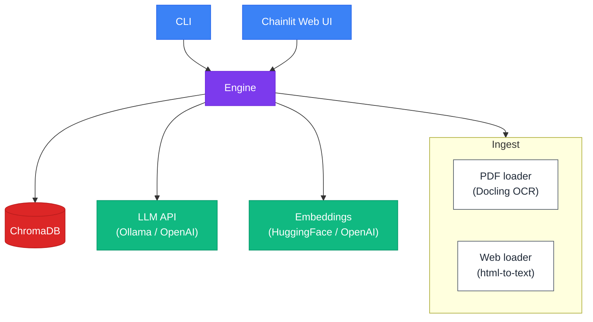

# Architecture

High-level overview of how textbook-ai is designed and why.

## System Overview



## Data Flow

A typical session follows these six steps:

1. **Config resolution** -- Defaults, user YAML, env vars, and CLI flags are merged into a single `AppConfig` (see [Configuration](configuration.md)).
2. **Source dispatch** -- The source type (`pdf` or `web`) routes to the appropriate ingestion loader.
3. **Document ingestion** -- The loader parses the source into LlamaIndex `Document` objects (Docling for PDFs, html-to-text for web pages).
4. **Chunking and embedding** -- Documents are split into chunks and embedded into vectors.
5. **Index storage** -- Vectors are stored in a ChromaDB collection. On subsequent runs the existing index is loaded from disk, skipping steps 2-4.
6. **Query loop** -- The chat engine retrieves relevant chunks and sends them alongside the user's question to the LLM, which generates an answer.

## Key Design Decisions

### Central Orchestrator

Both the CLI and the Chainlit web UI call a single function, `build_chat_engine()`, that handles the entire pipeline. Neither interface imports LlamaIndex directly. This keeps the interfaces thin and ensures consistent behavior regardless of how the app is launched.

### Hash-Based Collection Isolation

Each source gets its own ChromaDB collection. The collection name is the base name (e.g. `textbook`) plus a truncated SHA-256 hash of the source path (`textbook_a1b2c3d4e5f6`). This prevents collisions when multiple books share the same `persist_dir`.

### Lazy Index Creation

Before ingesting, the engine checks whether a ChromaDB collection with documents already exists. If it does, ingestion is skipped and the existing index is loaded directly. This makes repeat runs near-instant since PDF/web parsing is the most expensive step.

### Type-Based Source Dispatch

A dispatcher function routes to the correct loader based on `source_config.type`. Both PDF and web loaders share the same signature: `(str, IngestConfig) -> list[Document]`. Adding a new source type means writing a loader with that signature and adding one branch to the dispatcher.

### API Key Indirection

Config stores environment variable **names** rather than actual secrets. For example, `llm.api_key_env: "LLM_API_KEY"` in the YAML, and the actual key is read via `os.environ.get()` at runtime. This keeps secrets out of config files and lets different environments point to different variable names.

### Global Settings Configuration

LlamaIndex's `Settings` object (LLM, embeddings, chunk size) is configured once per `get_or_create_index()` call, before any index operations. This follows LlamaIndex's recommended pattern for module-level global settings.

## Module Dependencies

```
cli.py ─────────┐
chainlit_app.py ─┤
                 ▼
             engine.py
            ┌────┼────────┐
            ▼    ▼         ▼
        ingest/  index.py  types.py
        ┌──┴──┐     │
      pdf.py web.py │
                     ▼
                 config.py
```

Both entry points depend only on `engine.py`. The engine orchestrates `ingest/`, `index.py`, and `config.py`. The `config.py` module has no internal dependencies, making it easy to test in isolation.
